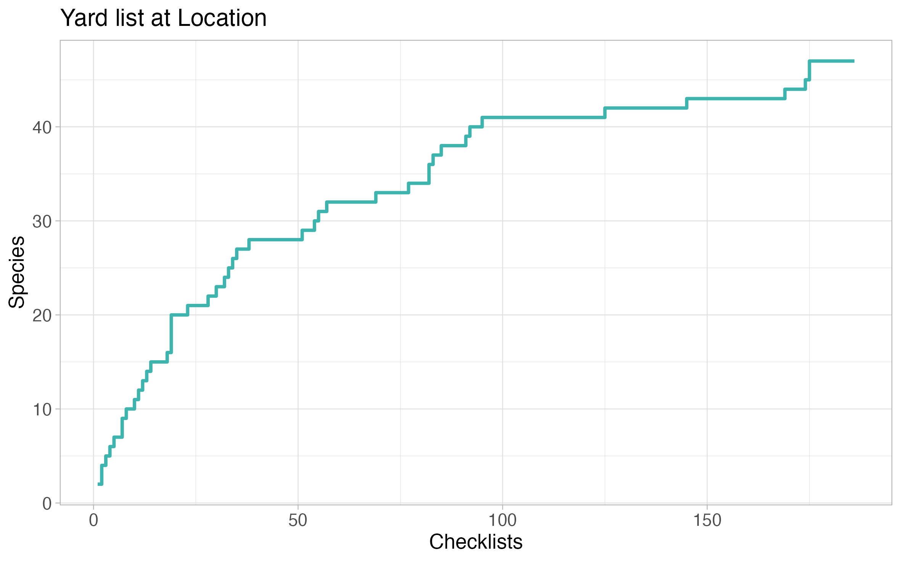

```{r, include = FALSE}
knitr::opts_chunk$set(
  collapse = TRUE,
  comment = "#>"
)
```

## File  Organization

First of all, you will need to [export your eBird data](https://ebird.org/downloadMyData).
You will receive an email with a zip file.
When extracted, your data will be in comma-separated format (.csv).
Yardlistr will always choose the last .csv file in the data directory in ascending alphanumeric order.

This example illustrates file selection.
Say you have the following three files in your data directory:

```
2022-08-02_ebird.csv
2022-06-01_ebird.csv
2021-04-16_ebird.csv
```
In ascending alphanumeric order, file ```2022-08-02_ebird.csv``` is last and will thus be used by yardlistr.

## Plotting Data

Once your folder structure is set up, you can run yardlistr.
The location name must be exactly the same as on eBird.

```{r eval = FALSE}
library(yardlistr)

yardlistr("My Location", "path/to/data_directory", "path/to/output_directory")
```

You can also set up a list with multiple locations and pass them to yardlistr one by one.

```{r eval = FALSE}
dir_input <- "./dir_data"
dir_output <- "./dir_plots"

list_locations <- c(
  "My yard",
  "My friend's yard",
  "My local hotspot"
)

list_locations |> purrr::walk(
  \(location) yardlistr::yardlistr(location, dir_input, dir_output)
)
```

### Species frequency

The frequency plot lists all observed species at the specified location in descending order with a bar representing the percentage of complete checklists that a particular species occurs in.
Species only observed in incidental checklists have a frequency of 0.0%.

```{r out.width = '100%', echo = FALSE}

```

### Heatmap

The heatmap plot is closely modeled after eBird's bar chart.
For a given species, it displays the percentage of checklists (complete and incidental) that species occurs in for each tetrad of the year.
The higher the frequency of a species in a certain tetrad is, the darker the colour will be.
Each month consists of four tetrads that comprise the following days of the month: 1st - 7th, 8th - 14th, 15th - 21st, 22nd - last.

```{r out.width = '100%', echo = FALSE}

```

### Species per list

The species per list plot showcases the trajectory of number of species on your location life list versus number of checklists at the location.
In some ways, it resembles a rarefaction curve.

```{r out.width = '100%', echo = FALSE}

```

### Species over time

This plot is similar to the species per list plot but instead shows how the number of species on your location life list developed over time.
Depending on how regularly you observe birds at the location, the two plots can look more or less similar.

```{r out.width = '100%', echo = FALSE}
knitr::include_graphics("location_time.png")
```

### Time of day

The time of day plot shows the distribution of checklists throughout the day.

```{r out.width = '100%', echo = FALSE}

```
